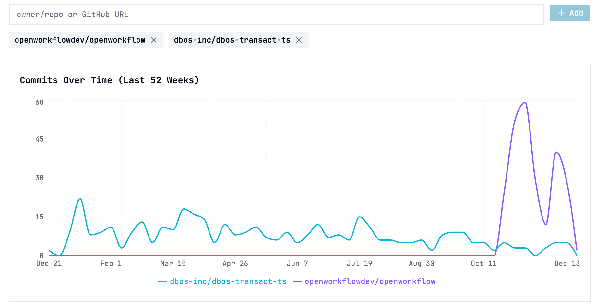

# GitBoard

Compare GitHub repositories to find the right one for your project.



## Why GitBoard?

Choosing between open source libraries can be difficult. Many tools offer similar features, making the decision seem straightforward. However, adopting a dead or dying project can cause long-term problems—dependencies become deeply embedded in your app and are hard to remove or replace.

GitHub doesn't make it easy to compare the vital signals of repositories: commit activity, contributor trends, issue velocity, and more. GitBoard gives you a single-page view of these metrics so you can make informed decisions about which projects are actively maintained and worth depending on.

## Features

- **Commit Activity** — View commit trends over the last 52 weeks
- **Contributor Trends** — Track how contributor activity changes over time
- **Issue Velocity** — Monitor issues opened per week
- **Issue Resolution** — See how many issues are being closed vs opened
- **Shareable URLs** — Repository selections are stored in the URL for easy sharing
- **Privacy-First** — GitHub tokens are stored locally in your browser, never sent to any server other than GitHub


## Getting Started

### Prerequisites

- Node.js 18+
- bun

### Installation

```bash
# Clone the repository
git clone https://github.com/harshpreet93/gitboard.git
cd gitboard

# Install dependencies
bun install

# Start the development server
bun run dev
```

The app will be available at `http://localhost:5173`.

### Usage

1. Enter repository names in the format `owner/repo` or paste full GitHub URLs
2. Add multiple repositories to compare them side by side
3. View the charts to compare commit activity, contributors, and issue metrics

### GitHub API Rate Limits

GitBoard uses the GitHub API which limits unauthenticated requests to 60 per hour. To increase this limit to 5,000 requests per hour, add a GitHub personal access token using the "Add token" button. Your token is stored locally and never shared.

## Tech Stack

- [React](https://react.dev/) — UI framework
- [TypeScript](https://www.typescriptlang.org/) — Type safety
- [Vite](https://vitejs.dev/) — Build tool
- [Tailwind CSS](https://tailwindcss.com/) — Styling
- [Recharts](https://recharts.org/) — Charts and visualizations
- [shadcn/ui](https://ui.shadcn.com/) — UI components

## Scripts

```bash
bun run dev      # Start development server
bun run build    # Build for production
bun run preview  # Preview production build
bun run lint     # Run ESLint
bun run deploy   # Deploy to Cloudflare Pages
```

## License

MIT
